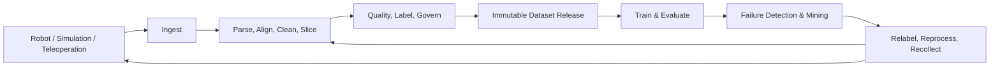
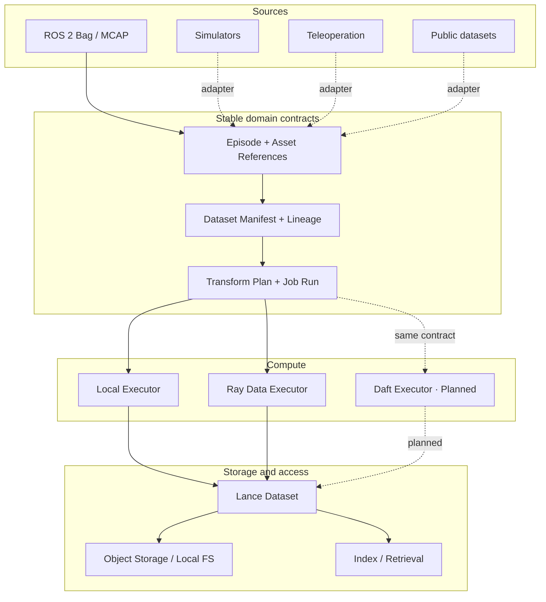

# Domena

> **Production-grade data flywheel infrastructure for Embodied AI and Physical AI.**

[简体中文](README.zh-CN.md) · [Project status](#project-status) · [Quick start](#quick-start) · [License](LICENSE)

> [!IMPORTANT]
> Domena is currently **Alpha**. Production-grade describes the project's architecture target and engineering standard—not a claim that every part of the data flywheel is complete. Source-neutral data contracts, dataset lineage, ROS 2/MCAP ingestion, Ray Data execution, and Lance materialization are implemented today. Annotation, automated quality policy, evaluation, and failure-driven recollection remain on the roadmap.

## What is Domena?

Domena is an open-source multimodal data platform for robot learning. It turns experience produced by real robots, simulators, and human teleoperation into traceable, reproducible, training-ready data assets.

Its long-term product boundary is the complete embodied-data flywheel:

> **Collect → Align & Clean → Quality & Label → Version → Train & Evaluate → Mine Failures → Recollect**

Embodied data is not just a collection of images or tables. One training example may span video, depth, point clouds, IMU, joint state, action trajectories, force/torque, task context, clock synchronization, coordinate frames, and hardware calibration. Domena is designed to give that heterogeneous data stable identity, explicit boundaries, verifiable quality, complete lineage, and reproducible processing from the moment it enters the system.

Domena is neither another training framework nor a file uploader for robot logs. It is the data layer shared by algorithm, robotics, and infrastructure teams—where every experiment, trajectory, and failure case can become a reusable asset for the next model iteration.

## Why the name “Domena”?

**Domena** is derived from the idea of a **domain**: a bounded realm with its own meaning, rules, and context.

In Physical AI, every embodiment, robot model, sensor suite, task, environment, and collection system creates a distinct data domain. Useful infrastructure must connect those domains without flattening away their semantics. That is the idea behind the name:

- **Domain-aware** — preserve task, embodiment, time, calibration, and provenance context.
- **Domain-neutral** — keep the core independent of ROS, a particular simulator, robot vendor, or storage engine.
- **Domain-connecting** — carry trustworthy experience across collection, datasets, training, evaluation, and back into better collection.

The name therefore reflects the project's central design principle: **unify the lifecycle, not erase the domains**.

## Why Domena?

Production embodied-AI teams repeatedly face the same system problems:

- Data for one task is fragmented across ROS bags, MCAP, HDF5, videos, point clouds, and custom logs.
- Sensor clocks, coordinate frames, calibration revisions, and robot variants can silently corrupt training data.
- It is difficult to reproduce which data trained a model, how it was transformed, and why it was selected.
- Volume is easy to count; completeness, consistency, diversity, and training fitness are not.
- Real-world failures rarely flow back reliably into curation, labelling, training, and regression evaluation.
- Local scripts prove ideas but do not scale cleanly to distributed processing and multi-team delivery.

Domena treats these as one lifecycle rather than a collection of disconnected tools.

## The data flywheel



The architecture deliberately separates three durable concerns:

1. **Experience contract** — what one bounded interaction is, including observations, actions, state, outcome, and physical context.
2. **Dataset release contract** — which Episodes form an immutable release, where they came from, why they were selected, and what produced them.
3. **Execution and materialization contract** — how one transform plan runs locally, on Ray Data, or eventually on Daft, and publishes a verified result to Lance.

## Architecture



### Design principles

- **Source-neutral core** — ROS, simulators, teleoperation systems, and public datasets enter through adapters; core semantics do not depend on one robotics ecosystem.
- **Multimodal by construction** — images, video, depth, point clouds, IMU, joints, actions, force/torque, and external large objects retain appropriate representations.
- **Episode-first semantics** — complete trajectories preserve time, task, outcome, and physical context.
- **Immutable, content-addressed releases** — Episodes, manifests, plans, and materializations use canonical fingerprints to prevent silent drift.
- **Lineage first** — data, versions, metrics, and failure evidence can be traced through stable identities.
- **Compute/storage separation** — plans are engine-neutral; local and Ray Data execution are implemented, with a compatible Daft boundary reserved.
- **Failure-safe publication** — data is staged, verified, and atomically published; failed jobs cannot expose a false successful release.
- **Progressive industrialization** — local workflows stay lightweight while distributed compute, object storage, and cloud deployment remain optional capabilities.

## Implemented today

| Area | Current capability |
|---|---|
| Experience Contract | Source-neutral `Episode`, Step, task/physical context, Outcome, and external Asset Reference |
| Validation | Path-addressable validation, deterministic JSON round trips, and canonical SHA-256 content fingerprints |
| Dataset Governance | Immutable Dataset Manifest, source namespace, membership, splits, construction records, parents, and evidence references |
| ROS Ingestion | ROS 2 + MCAP, with explicit whole-bag or caller-indexed multi-Episode boundaries |
| Execution Contract | Immutable Transform Plan, Job Run, Failure Evidence, and Materialization Reference |
| Compute | Deterministic local execution and bounded Ray Data execution |
| Storage | Lance staging, verification, atomic publication, release-scoped reads, and Episode lookup |
| Failure Safety | Diagnosable failed runs never return or publish a false successful materialization |
| Verification | Core unit tests and Ray Data → Lance → Read end-to-end integration coverage |

The first canonical transform is `domena.identity/v1`. It validates the complete Manifest-to-Ray-to-Lance data plane. Versioned decoding, synchronization, cleaning, quality, and training-set construction operators are the next layer—not features that the project claims to have already completed.

## Project status

| Milestone | Status | Outcome |
|---|---:|---|
| M1a | ✅ | Episode contract, validation, serialization, fingerprinting, and mock source |
| M1b | ✅ | Dataset manifests, immutable membership, source namespaces, and lineage |
| M2 | ✅ | First real source: ROS 2 Bag + MCAP adapter |
| M3 | ✅ | Initial Ray Data compute and Lance lake materialization data plane |
| Next | Planned | Multimodal operators, quality reports, failure slices, and a minimal training/evaluation feedback loop |
| Later | Planned | Daft execution, more ecosystem formats, collaborative annotation, control plane, and visualization |

Domena is currently **Alpha**. The verifiable platform foundation exists; the full product does not. Public APIs may evolve before 1.0.

## Quick start

Python 3.11 or newer is required. Install from source:

```bash
git clone https://github.com/cybertronic23/domena.git
cd domena
python -m venv .venv
source .venv/bin/activate
python -m pip install -e .
```

Install optional integrations as needed:

```bash
# Ray Data + Lance
python -m pip install -e ".[ray-lance]"

# ROS 2 MCAP reader
python -m pip install -e ".[rosbag2]"

# All currently supported optional integrations
python -m pip install -e ".[ray-lance,rosbag2]"
```

Run the test suite:

```bash
PYTHONPATH=src python -m unittest discover -s tests -v
```

Minimal contract example:

```python
from domena import fingerprint_episode, make_mock_episode, validate_episode

episode = make_mock_episode()
result = validate_episode(episode)
if not result.is_valid:
    raise ValueError(result.issues)

print(episode.episode_id)
print(fingerprint_episode(episode))
```

## Design governance

Domena uses [OpenSpec](openspec/) for implementation-ready changes. A significant milestone should have a proposal, design, specification, and task list before implementation, with both English and Simplified Chinese versions whenever practical.

Stable user and contributor documentation will move into `docs/` as interfaces mature. Research material, discussion drafts, and unresolved alternatives are not treated as public project contracts.

## What Domena is not

- It is not a robot training framework; it supplies trustworthy data to training and evaluation systems.
- It is not a replacement for ROS; ROS is one pluggable source.
- It is not a generic BI warehouse; it preserves temporal, physical, and task semantics.
- It does not force every ecosystem format into one physical file; it unifies identity, lineage, and processing semantics while allowing assets to retain suitable representations.

## Contributing

Domena is still defining its first stable contributor surface. Until contribution guides are published under `docs/`, please use approved OpenSpec changes and existing tests as the source of truth for behavior.

## License

Domena is released under the [MIT License](LICENSE).
