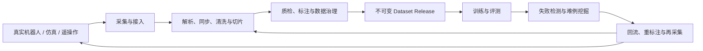
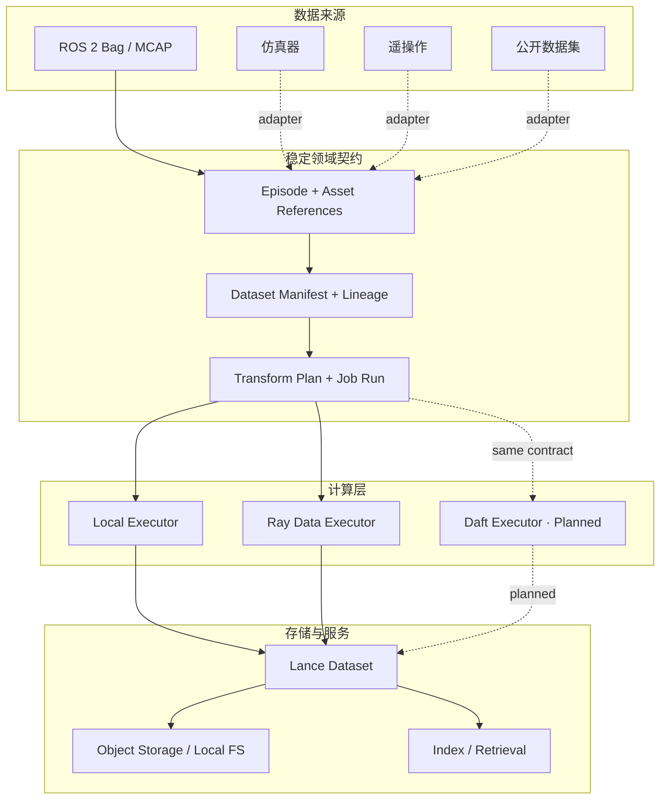
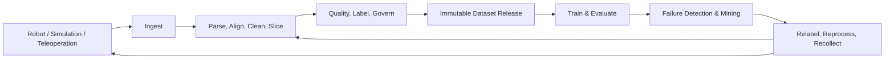

# Domena

> **Production-grade data flywheel infrastructure for Embodied AI and Physical AI.**  
> **面向具身智能与物理 AI 的生产级数据闭环基础设施。**

[简体中文](#简体中文) · [English](#english) · [License](LICENSE)

> [!IMPORTANT]
> Domena is an early-stage open-source project with production-grade design goals. The foundational contracts, ROS 2/MCAP ingestion, Ray Data execution, and Lance materialization are implemented; annotation, automated quality policies, evaluation, and failure-driven recollection are planned rather than claimed as complete.

---

## 简体中文

### Domena 是什么？

Domena 是一个为机器人学习构建的开源多模态数据平台。它面向真实机器人、仿真器和人类遥操作产生的经验数据，将分散的数据采集、处理、治理、训练集构建、评测和失败回流连接成可复现的数据飞轮：

> **采集 → 清洗与对齐 → 质检与标注 → 数据集版本 → 训练与评测 → 失败样本回流 → 再采集**

具身数据并不是普通的图片或表格集合。一个可训练样本往往同时包含视频、深度、点云、IMU、关节状态、动作轨迹、力觉、任务上下文、时间同步信息和硬件标定信息。Domena 的目标，是让这些异构数据从进入系统开始，就具备稳定身份、明确边界、可验证质量、完整血缘和可重现处理过程。

Domena 不是又一个训练框架，也不是把机器人文件简单上传到对象存储的工具。它定位于算法、机器人和基础设施团队之间的数据层：让每一次实验、每一条轨迹和每一个失败案例都能够被追踪、复用，并转化为下一轮模型改进的数据资产。

### 为什么需要 Domena？

工业级具身智能团队通常会同时面对以下问题：

- 同一任务的数据散落在 ROS bag、MCAP、HDF5、视频、点云和自定义日志中。
- 多传感器时间戳、坐标系、标定版本和机器人型号差异会直接污染训练数据。
- “这个模型使用了哪些数据、经过哪些处理、为什么进入训练集”难以重现。
- 数据数量容易统计，但完整性、一致性、多样性和训练适用性缺少统一度量。
- 线上或真机失败案例不能可靠地回流到筛选、标注、训练和回归评测流程。
- 单机脚本可以验证算法，却难以扩展到 PB 级数据、并行任务和多人协作。

Domena 将这些问题视为一个统一的生命周期，而不是彼此割裂的工具集合。

### 数据飞轮



平台围绕三个不可混淆的层次设计：

1. **经验数据契约**：一次有边界的机器人交互是什么，包含哪些观测、动作、状态、结果与物理上下文。
2. **数据集发布契约**：哪些 Episode 构成某个不可变数据集版本，它们来自哪里、为何被选入、经过了什么处理。
3. **执行与物化契约**：同一处理计划如何由本地、Ray Data 或后续 Daft 执行，并以可验证、不可覆盖的方式发布到 Lance。

### 架构原则

- **数据源无关的核心**：ROS、仿真器、遥操作设备和公开数据集通过边界适配器进入统一契约，核心模型不依赖某个机器人生态。
- **多模态原生**：同时描述图像、视频、深度、点云、IMU、关节、动作、力觉和外部大对象，而不是把所有内容压成单一表格。
- **Episode 优先**：以完整交互轨迹为基本语义单元，保留时序、任务、结果和物理上下文。
- **不可变发布与内容寻址**：Episode、Manifest、处理计划和物化结果均使用规范化指纹，防止数据静默漂移。
- **血缘优先**：数据、模型、版本、指标和失败证据可以沿稳定标识追溯。
- **计算与存储解耦**：执行计划不绑定引擎；当前支持本地执行与 Ray Data，并为 Daft 预留相同边界。
- **失败安全发布**：数据先写入 staging，完成模式和行数校验后再原子发布；失败任务不能产生看似成功的数据版本。
- **渐进式工业化**：本地开发保持轻量，分布式计算、对象存储和云原生部署通过可选能力逐步启用。

### 当前架构



### 已实现能力

| 领域 | 当前能力 |
|---|---|
| Experience Contract | 来源无关的 `Episode`、Step、任务/物理上下文、Outcome、外部 Asset Reference |
| Validation | 路径可定位的结构化校验、确定性 JSON 往返、规范化 SHA-256 内容指纹 |
| Dataset Governance | 不可变 Dataset Manifest、来源命名空间、成员身份、split、构建记录、父版本和证据引用 |
| ROS 数据接入 | ROS 2 + MCAP；支持整包单 Episode，以及调用方提供显式切分索引的多 Episode |
| Execution Contract | 不可变 Transform Plan、Job Run、Failure Evidence、Materialization Reference |
| Compute | 确定性本地执行器和 Ray Data 有界分布式执行器 |
| Storage | Lance staging、校验、原子发布、Release 范围读取与按 Episode 查询 |
| Failure Safety | 失败运行保留可诊断证据，且不会返回或发布伪成功物化结果 |
| Verification | 核心单元测试，以及 Ray Data → Lance → Read 的端到端集成测试 |

当前首个规范化变换是 `domena.identity/v1`，用于验证从 Manifest 到分布式执行和 Lance 发布的完整数据平面。真正的解码、同步、清洗、质量和训练集构建算子将以显式版本逐步加入。

### 项目阶段

| 阶段 | 状态 | 结果 |
|---|---:|---|
| M1a | ✅ | Episode 经验数据契约、校验、序列化、指纹和 Mock Source |
| M1b | ✅ | Dataset Manifest、不可变成员关系、来源命名空间和血缘 |
| M2 | ✅ | 首个真实数据源：ROS 2 Bag + MCAP 适配器 |
| M3 | ✅ | Ray Data 计算与 Lance 数据湖物化的首个数据平面 |
| 下一阶段 | 规划中 | 多模态处理算子、质量报告、失败切片和最小训练/评测回流 |
| 后续阶段 | 规划中 | Daft 执行器、更多生态格式、标注协作、控制面和可视化 |

项目仍处于 **Alpha**。已完成的是可验证的平台骨架，而不是完整的数据平台产品。公开 API 在 1.0 前仍可能演进。

### 快速开始

要求 Python 3.11 或更高版本。当前建议从源码安装：

```bash
git clone <your-domena-repository-url>
cd domena
python -m venv .venv
source .venv/bin/activate
python -m pip install -e .
```

按需安装数据引擎和 ROS 2 MCAP 适配器：

```bash
# Ray Data + Lance
python -m pip install -e ".[ray-lance]"

# ROS 2 MCAP reader
python -m pip install -e ".[rosbag2]"

# All currently supported optional integrations
python -m pip install -e ".[ray-lance,rosbag2]"
```

运行测试：

```bash
PYTHONPATH=src python -m unittest discover -s tests -v
```

最小契约示例：

```python
from domena import fingerprint_episode, make_mock_episode, validate_episode

episode = make_mock_episode()
result = validate_episode(episode)
result.raise_for_errors()

print(episode.episode_id)
print(fingerprint_episode(episode))
```

### 设计与变更治理

Domena 使用 [OpenSpec](openspec/) 管理已经明确、可直接实施的设计变更。每个重要阶段在进入实现前都应具备 proposal、design、spec 和 tasks，并尽可能同时提供英文与简体中文版本。

稳定的用户和贡献者文档将在接口成熟后进入 `docs/`。研究资料、讨论草稿和未决方案不作为公开项目契约。

### Domena 不是什么

- 不是机器人训练框架；它向训练与评测系统提供可信数据。
- 不是 ROS 的替代品；ROS 只是可插拔数据来源之一。
- 不是通用 BI 数据仓库；它保留具身交互的时序、物理和任务语义。
- 不是把所有生态格式强行转换成一种文件；它统一身份、血缘和处理语义，并允许资产保持合适的物理表示。

---

## English

### What is Domena?

Domena is an open-source multimodal data platform for robot learning. It connects experience produced by real robots, simulators, and human teleoperation into a reproducible data flywheel:

> **Collect → Align & Clean → Quality & Label → Version → Train & Evaluate → Mine Failures → Recollect**

Embodied data is not merely a collection of images or tables. A training example may span video, depth, point clouds, IMU, joint state, action trajectories, force/torque, task context, clock synchronization, and hardware calibration. Domena is designed to give that heterogeneous data stable identity, explicit boundaries, verifiable quality, complete lineage, and reproducible processing from the moment it enters the system.

Domena is neither another training framework nor a file uploader for robot logs. It is the data layer shared by algorithm, robotics, and infrastructure teams—where every experiment, trajectory, and failure case can become a traceable and reusable asset for the next model iteration.

### Why Domena?

Production embodied-AI teams repeatedly face the same system problems:

- Data for one task is fragmented across ROS bags, MCAP, HDF5, videos, point clouds, and custom logs.
- Sensor clocks, coordinate frames, calibration revisions, and robot variants can silently corrupt training data.
- It is difficult to reproduce which data trained a model, how it was transformed, and why it was selected.
- Volume is easy to count; completeness, consistency, diversity, and training fitness are not.
- Real-world failures rarely flow back reliably into curation, labelling, training, and regression evaluation.
- Local scripts prove ideas but do not scale cleanly to distributed processing and multi-team delivery.

Domena treats these as one lifecycle rather than a collection of disconnected tools.

### The data flywheel



The architecture deliberately separates three durable concerns:

1. **Experience contract** — what one bounded interaction is, including observations, actions, state, outcome, and physical context.
2. **Dataset release contract** — which Episodes form an immutable release, where they came from, why they were selected, and what produced them.
3. **Execution and materialization contract** — how one transform plan runs locally, on Ray Data, or eventually on Daft, and publishes a verified result to Lance.

### Design principles

- **Source-neutral core** — ROS, simulators, teleoperation systems, and public datasets enter through adapters; core semantics do not depend on one robotics ecosystem.
- **Multimodal by construction** — images, video, depth, point clouds, IMU, joints, actions, force/torque, and external large objects retain appropriate representations.
- **Episode-first semantics** — complete trajectories preserve time, task, outcome, and physical context.
- **Immutable, content-addressed releases** — Episodes, manifests, plans, and materializations use canonical fingerprints to prevent silent drift.
- **Lineage first** — data, model, version, metric, and failure evidence can be traced through stable identities.
- **Compute/storage separation** — plans are engine-neutral; local and Ray Data execution are implemented, with a compatible Daft boundary reserved.
- **Failure-safe publication** — data is staged, verified, and atomically published; failed jobs cannot expose a false successful release.
- **Progressive industrialization** — local workflows stay lightweight while distributed compute, object storage, and cloud deployment remain optional capabilities.

### Implemented today

| Area | Current capability |
|---|---|
| Experience Contract | Source-neutral `Episode`, Step, task/physical context, Outcome, and external Asset Reference |
| Validation | Path-addressable validation, deterministic JSON round trips, and canonical SHA-256 content fingerprints |
| Dataset Governance | Immutable Dataset Manifest, source namespace, membership, splits, construction records, parents, and evidence references |
| ROS Ingestion | ROS 2 + MCAP, with explicit whole-bag or caller-indexed multi-Episode boundaries |
| Execution Contract | Immutable Transform Plan, Job Run, Failure Evidence, and Materialization Reference |
| Compute | Deterministic local execution and bounded Ray Data execution |
| Storage | Lance staging, verification, atomic publication, release-scoped reads, and Episode lookup |
| Failure Safety | Diagnosable failed runs never return or publish a false successful materialization |
| Verification | Core unit tests and Ray Data → Lance → Read end-to-end integration coverage |

The first canonical transform is `domena.identity/v1`. It validates the complete Manifest-to-Ray-to-Lance data plane. Versioned decoding, synchronization, cleaning, quality, and training-set construction operators are the next layer—not features that the project claims to have already completed.

### Project status

| Milestone | Status | Outcome |
|---|---:|---|
| M1a | ✅ | Episode contract, validation, serialization, fingerprinting, and mock source |
| M1b | ✅ | Dataset manifests, immutable membership, source namespaces, and lineage |
| M2 | ✅ | First real source: ROS 2 Bag + MCAP adapter |
| M3 | ✅ | Initial Ray Data compute and Lance lake materialization data plane |
| Next | Planned | Multimodal operators, quality reports, failure slices, and a minimal training/evaluation feedback loop |
| Later | Planned | Daft execution, more ecosystem formats, collaborative annotation, control plane, and visualization |

Domena is currently **Alpha**. The verifiable platform foundation exists; the full product does not. Public APIs may evolve before 1.0.

### Quick start

Python 3.11 or newer is required. Install from source:

```bash
git clone <your-domena-repository-url>
cd domena
python -m venv .venv
source .venv/bin/activate
python -m pip install -e .
```

Install optional integrations as needed:

```bash
# Ray Data + Lance
python -m pip install -e ".[ray-lance]"

# ROS 2 MCAP reader
python -m pip install -e ".[rosbag2]"

# All currently supported optional integrations
python -m pip install -e ".[ray-lance,rosbag2]"
```

Run the test suite:

```bash
PYTHONPATH=src python -m unittest discover -s tests -v
```

Minimal contract example:

```python
from domena import fingerprint_episode, make_mock_episode, validate_episode

episode = make_mock_episode()
result = validate_episode(episode)
result.raise_for_errors()

print(episode.episode_id)
print(fingerprint_episode(episode))
```

### Design governance

Domena uses [OpenSpec](openspec/) for implementation-ready changes. A significant milestone should have a proposal, design, specification, and task list before implementation, with both English and Simplified Chinese versions whenever practical.

Stable user and contributor documentation will move into `docs/` as interfaces mature. Research material, discussion drafts, and unresolved alternatives are not treated as public project contracts.

### What Domena is not

- It is not a robot training framework; it supplies trustworthy data to training and evaluation systems.
- It is not a replacement for ROS; ROS is one pluggable source.
- It is not a generic BI warehouse; it preserves temporal, physical, and task semantics.
- It does not force every ecosystem format into one physical file; it unifies identity, lineage, and processing semantics while allowing assets to retain suitable representations.

## Contributing

Domena is still defining its first stable contributor surface. Until contribution guides are published under `docs/`, please use the approved OpenSpec changes and existing tests as the source of truth for behavior.

## License

Domena is released under the [MIT License](LICENSE).
