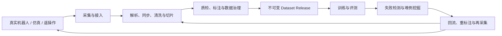
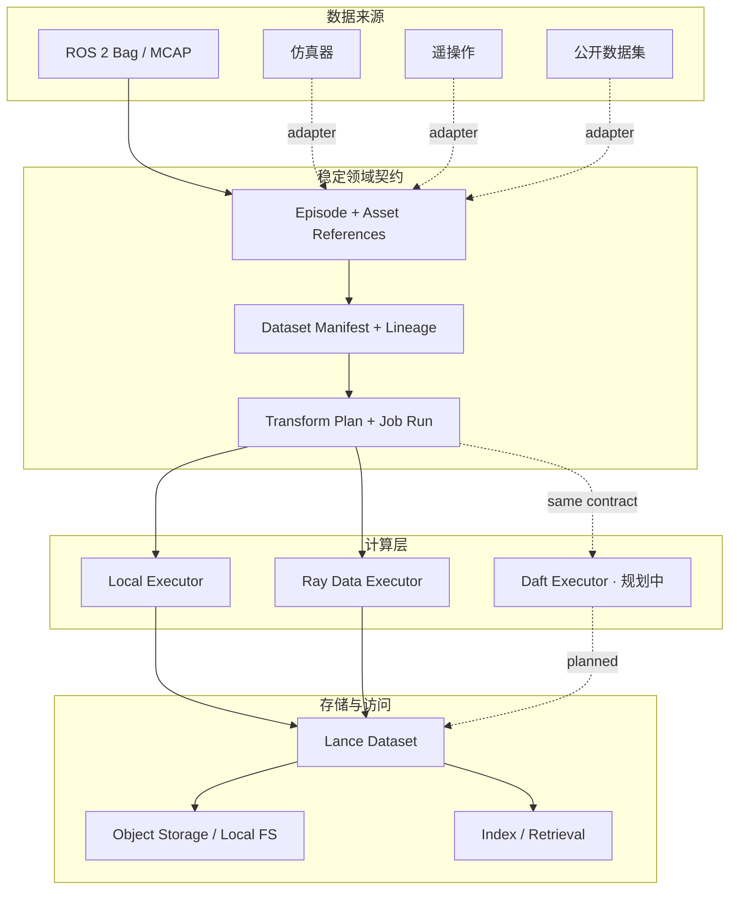

# Domena

> **面向具身智能与物理 AI 的生产级数据闭环（数据飞轮）基础设施。**

[English](README.md) · [项目进度](#项目进度) · [快速开始](#快速开始) · [许可证](LICENSE)

> [!IMPORTANT]
> Domena 当前处于 **Alpha** 阶段。“生产级”描述的是项目的架构目标和工程标准，并非宣称完整数据飞轮已经全部实现。目前已经完成数据源无关契约、数据集血缘、ROS 2/MCAP 接入、Ray Data 执行和 Lance 物化；标注、自动化质量策略、评测与失败驱动回采仍在路线图中。

## Domena 是什么？

Domena 是一个面向机器人学习的开源多模态数据平台。它将真实机器人、仿真器和人类遥操作产生的 Experience，转化为可追溯、可复现、可供训练的数据资产。

它的长期产品边界是完整的具身数据飞轮：

> **采集 → 对齐与清洗 → 质检与标注 → 数据集版本 → 训练与评测 → 失败挖掘 → 定向回采**

具身数据并不是普通的图片或表格集合。一个训练样本往往同时包含视频、深度、点云、IMU、关节状态、动作轨迹、力觉、任务上下文、时间同步、坐标系和硬件标定信息。Domena 的目标，是让这些异构数据从进入系统开始就具备稳定身份、明确边界、可验证质量、完整血缘和可复现的处理过程。

Domena 不是另一个训练框架，也不是把机器人日志上传到对象存储的文件工具。它定位于算法、机器人和基础设施团队之间的数据层：让每一次实验、每一条轨迹和每一个失败案例，都可以成为下一轮模型迭代中可复用的数据资产。

## 为什么叫 “Domena”？

**Domena** 的灵感来自古希腊语 **δεδομένα（*dedomena*）**，意为“被给予之物”。它也是欧几里得著作《Data》的希腊文标题；这部著作讨论的是：在一个问题中，哪些条件是已经给定的，以及能够从这些“给定之物”进一步推导出什么。拉丁语 *datum* 同样表达“被给予之物”，其复数 *data* 后来成为今天的“数据”。

Domena 是从 *dedomena* 中提炼出的现代化项目名称，并不是在声称 *Domena* 本身就是古希腊语中的“数据”。这个名字保留了 *dedomena* 的声音与语源故事，同时更加简洁、易读、容易记忆。

这个来源与具身智能非常契合：机器人和仿真器不断给予我们观测、状态、动作、轨迹、传感器流和任务结果。它们最初只是一个个“给定之物”；Domena 要做的，是把这些原始数据转化为可治理、可验证、可复用的经验，使模型能够从中学习，并进一步推导出更好的行动。

**Domena —— 面向具身智能的数据与经验基础设施。**

## 为什么需要 Domena？

工业级具身智能团队通常会同时面对以下问题：

- 同一任务的数据散落在 ROS bag、MCAP、HDF5、视频、点云和自定义日志中。
- 多传感器时钟、坐标系、标定版本和机器人型号差异会直接污染训练数据。
- “这个模型使用了哪些数据、经过哪些处理、为什么进入训练集”难以复现。
- 数据数量容易统计，但完整性、一致性、多样性和训练适用性缺少统一度量。
- 线上或真机失败案例不能可靠地回流到筛选、标注、训练和回归评测流程。
- 单机脚本可以验证算法，却难以扩展到分布式处理和多团队协作交付。

Domena 将这些问题视为同一个生命周期，而不是彼此割裂的工具集合。

## 数据飞轮



平台刻意分离三个长期稳定的关注点：

1. **经验数据契约**：一次有边界的机器人交互是什么，包含哪些观测、动作、状态、结果与物理上下文。
2. **数据集发布契约**：哪些 Episode 构成某个不可变数据集版本，它们来自哪里、为何被选入、经过了什么处理。
3. **执行与物化契约**：同一处理计划如何由本地、Ray Data 或后续 Daft 执行，并以可验证、不可覆盖的方式发布到 Lance。

## 系统架构



### 设计原则

- **数据源无关的核心**：ROS、仿真器、遥操作设备和公开数据集通过边界适配器进入统一契约，核心语义不依赖某个机器人生态。
- **多模态原生**：同时描述图像、视频、深度、点云、IMU、关节、动作、力觉和外部大对象，并让它们保持合适的物理表示。
- **Episode 优先**：以完整交互轨迹为基本语义单元，保留时序、任务、结果和物理上下文。
- **不可变发布与内容寻址**：Episode、Manifest、处理计划和物化结果均使用规范化指纹，防止数据静默漂移。
- **血缘优先**：数据、版本、指标和失败证据可以沿稳定标识追溯。
- **计算与存储解耦**：执行计划不绑定引擎；当前支持本地执行与 Ray Data，并为 Daft 预留相同边界。
- **失败安全发布**：数据先写入 staging，完成模式和行数校验后再原子发布；失败任务不能产生看似成功的数据版本。
- **渐进式工业化**：本地开发保持轻量，分布式计算、对象存储和云原生部署通过可选能力逐步启用。

## 当前已实现

| 领域 | 当前能力 |
|---|---|
| Experience Contract | 数据源无关的 `Episode`、Step、任务/物理上下文、Outcome、外部 Asset Reference |
| Validation | 路径可定位的结构化校验、确定性 JSON 往返、规范化 SHA-256 内容指纹 |
| Dataset Governance | 不可变 Dataset Manifest、来源命名空间、成员身份、split、构建记录、父版本和证据引用 |
| ROS 数据接入 | ROS 2 + MCAP；支持整包单 Episode，以及调用方提供显式切分索引的多 Episode |
| Execution Contract | 不可变 Transform Plan、Job Run、Failure Evidence、Materialization Reference |
| Compute | 确定性本地执行器和 Ray Data 有界分布式执行器 |
| Storage | Lance staging、校验、原子发布、Release 范围读取与按 Episode 查询 |
| Failure Safety | 失败运行保留可诊断证据，且不会返回或发布伪成功物化结果 |
| Verification | 核心单元测试，以及 Ray Data → Lance → Read 端到端集成测试 |

当前首个规范化变换是 `domena.identity/v1`，用于验证从 Manifest 到 Ray 再到 Lance 发布的完整数据平面。真正的解码、同步、清洗、质量和训练集构建算子将以显式版本逐步加入；项目不会把规划能力描述成已完成功能。

## 项目进度

| 阶段 | 状态 | 结果 |
|---|---:|---|
| M1a | ✅ | Episode 经验数据契约、校验、序列化、指纹和 Mock Source |
| M1b | ✅ | Dataset Manifest、不可变成员关系、来源命名空间和血缘 |
| M2 | ✅ | 首个真实数据源：ROS 2 Bag + MCAP 适配器 |
| M3 | ✅ | Ray Data 计算与 Lance 数据湖物化的首个数据平面 |
| 下一阶段 | 规划中 | 多模态处理算子、质量报告、失败切片和最小训练/评测回流 |
| 后续阶段 | 规划中 | Daft 执行器、更多生态格式、标注协作、控制面和可视化 |

Domena 目前仍处于 **Alpha**。已经完成的是可以被验证的平台骨架，而不是完整的数据平台产品。公开 API 在 1.0 前仍可能演进。

## 快速开始

要求 Python 3.11 或更高版本。当前建议从源码安装：

```bash
git clone https://github.com/cybertronic23/domena.git
cd domena
python -m venv .venv
source .venv/bin/activate
python -m pip install -e .
```

按需安装数据引擎和 ROS 2 MCAP 适配器：

```bash
# Ray Data + Lance
python -m pip install -e ".[ray-lance]"

# ROS 2 MCAP reader
python -m pip install -e ".[rosbag2]"

# 当前全部可选集成
python -m pip install -e ".[ray-lance,rosbag2]"
```

运行测试：

```bash
PYTHONPATH=src python -m unittest discover -s tests -v
```

最小契约示例：

```python
from domena import fingerprint_episode, make_mock_episode, validate_episode

episode = make_mock_episode()
result = validate_episode(episode)
if not result.is_valid:
    raise ValueError(result.issues)

print(episode.episode_id)
print(fingerprint_episode(episode))
```

## 设计与变更治理

Domena 使用 [OpenSpec](openspec/) 管理已经明确、可直接实施的设计变更。每个重要阶段在进入实现前都应具备 proposal、design、spec 和 tasks，并尽可能同时提供英文与简体中文版本。

稳定的用户和贡献者文档将在接口成熟后进入 `docs/`。研究资料、讨论草稿和未决方案不作为公开项目契约。

## Domena 不是什么

- 不是机器人训练框架；它向训练与评测系统提供可信数据。
- 不是 ROS 的替代品；ROS 只是可插拔数据来源之一。
- 不是通用 BI 数据仓库；它保留具身交互的时序、物理和任务语义。
- 不是把所有生态格式强行转换成一种文件；它统一身份、血缘和处理语义，并允许资产保持合适的物理表示。

## 参与贡献

Domena 正在形成第一套稳定的贡献者接口。在贡献指南进入 `docs/` 前，请将已经批准的 OpenSpec 变更和现有测试作为行为事实来源。

## 许可证

Domena 使用 [MIT License](LICENSE) 发布。
